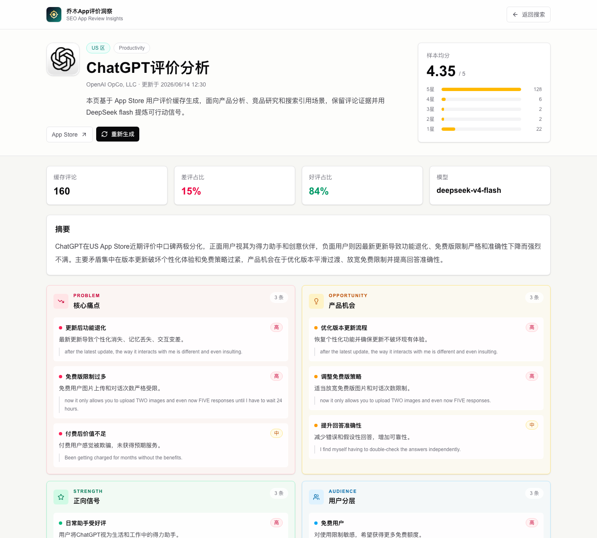
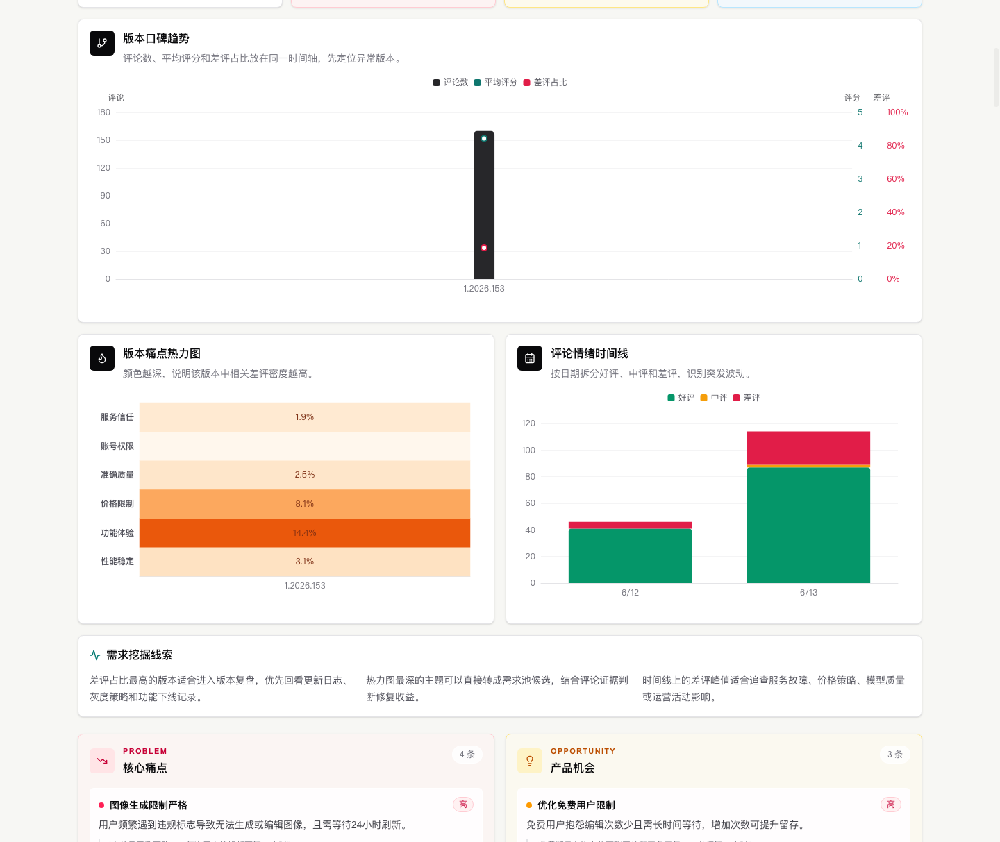

# qiaomu-app-review-skill

> App Store 评论不是“用户留言板”，它是最便宜、最真实的产品研究资料。
> 这个 skill 让你的 Agent 学会抓取、整理和引用 App Store 评论，把真实用户反馈变成痛点、机会、版本风险和可复盘的产品洞察。

[](#安装)
[](https://appreview.qiaomu.ai)
[](https://github.com/joeseesun/qiaomu-app-review-insights)
[](LICENSE)



## 为什么值得装？

你问 AI：“帮我看看某个 App 的用户评价。”

普通答案通常会变成泛泛总结。

装上这个 skill 后，Agent 会按产品研究的方式工作：

- 先找到 App 和国家区
- 本地抓取 App Store 用户评论，不依赖乔木 App 洞察网站
- 保留证据句，而不是只给空洞判断
- 用你当前正在使用的 Agent 模型提炼摘要、核心痛点、产品机会、正向信号、用户分层、版本风险和行动建议
- 生成 `reviews.json`、`evidence.md`、`evidence.html` 和 `agent-prompt.md`
- 需要时把最终报告渲染成带图表仪表盘的本地 HTML 页面查看
- 也可以搭配公开站点或你自己部署的网站使用

## 安装

```bash
npx skills add joeseesun/qiaomu-app-review-skill
```

安装后，对你的 Agent 这样说就行：

- `分析 ChatGPT 的 App Store 评价，重点看产品机会和版本风险`
- `找一个 AI 写作 App 的差评痛点，看看有没有独立开发机会`
- `把这个 App 的用户评论整理成产品洞察页`
- `比较两个竞品 App 的评论，告诉我用户真正不满的地方`

## 它会输出什么？

| 模块 | 你会得到什么 |
| --- | --- |
| 摘要 | 一段能被产品、调研和内容团队直接使用的口碑概述 |
| 核心痛点 | 用户反复抱怨的问题，附评论证据 |
| 产品机会 | 能进入需求池、路线图或独立产品切口的机会 |
| 正向信号 | 用户给高分的原因和不可丢失的价值点 |
| 用户分层 | 免费用户、付费用户、重度用户、专业用户等关注点 |
| 版本风险 | 和更新、功能退化、性能、价格策略相关的风险 |
| 行动建议 | 下一步产品动作、调研动作和修复优先级 |



## 前置条件

- [ ] 已安装支持 Agent Skills 的工具，例如 Codex、OpenCode、Cursor、Cline、Warp 等。
- [ ] 已安装 Node.js 和 npm。验证：`node -v && npm -v`
- [ ] 本地 skill 模式不需要任何 LLM API Key。
- [ ] 如果要自己部署网站，才需要准备 OpenAI-compatible API Key。
- [ ] 如果只想先体验，也可以直接用线上站点：https://appreview.qiaomu.ai

## 本地独立运行

这个 skill 不要求你使用乔木 App 洞察网站。它自带一个零依赖 Node.js 脚本，用来抓取评论并生成证据包：

```bash
node scripts/app_review_local.mjs \
  --query "ChatGPT" \
  --country us \
  --max-reviews 120 \
  --out ./app-review-output/chatgpt
```

也可以直接传 App Store 链接或 App ID：

```bash
node scripts/app_review_local.mjs \
  --query "https://apps.apple.com/us/app/chatgpt/id6448311069" \
  --max-reviews 120 \
  --out ./app-review-output/chatgpt
```

生成文件：

| 文件 | 用途 |
| --- | --- |
| `reviews.json` | 结构化评论数据、星级统计、版本分布和 App 信息 |
| `evidence.md` | 可读的证据包，包含差评、好评、中性评论样本 |
| `evidence.html` | 可以直接在浏览器打开的本地图表证据页 |
| `agent-prompt.md` | 给当前 Agent 的分析提示词 |

`evidence.html` 会自动生成实用图表：星级分布、口碑结构、版本风险、评论走势、高频词和不同星级的表达强度。

然后让你的 Agent 基于 `reviews.json` 或 `evidence.md` 写 `insight.md`。写完后可以渲染成同样带图表的本地 HTML：

```bash
node scripts/app_review_local.mjs \
  --render-md ./app-review-output/chatgpt/insight.md \
  --data ./app-review-output/chatgpt/reviews.json \
  --html ./app-review-output/chatgpt/insight.html \
  --title "ChatGPT 评价洞察"
```

## 可选：搭配网站源码使用

网站源码在这里：

```bash
git clone https://github.com/joeseesun/qiaomu-app-review-insights.git
cd qiaomu-app-review-insights
npm install
cp .env.example .env.local
npm run dev
```

本地 skill 不需要这些变量。只有你自己部署网站时，才需要配置模型服务：

```env
QIAOMU_LLM_API_KEY=your_api_key
QIAOMU_LLM_BASE_URL=https://your-openai-compatible-endpoint/v1
QIAOMU_LLM_MODEL=your_model
```

## 可选：网站 API 示例

生成或读取缓存页：

```bash
curl -X POST https://appreview.qiaomu.ai/api/research \
  -H 'Content-Type: application/json' \
  -d '{"query":"ChatGPT","country":"us","maxReviews":160}'
```

强制重新生成：

```bash
curl -X POST https://appreview.qiaomu.ai/api/research/regenerate \
  -H 'Content-Type: application/json' \
  -d '{"appId":"6448311069","country":"us","maxReviews":160}'
```

## 适合的场景

- 上线新功能前，研究竞品最近差评
- 想做独立 App，但不知道用户真实痛点在哪里
- 做产品复盘，判断版本更新是不是引发了口碑波动
- 给内容或增长页面补有证据的用户评价素材
- 给需求池补“来自真实用户评论”的证据链

## Troubleshooting

| 问题 | 解决方法 |
| --- | --- |
| `npx skills add` 找不到 skill | 确认仓库名是 `joeseesun/qiaomu-app-review-skill`，并检查网络或 GitHub 访问。 |
| Agent 只给泛泛总结 | 明确要求“保留评论证据，并按痛点、机会、版本风险输出”。 |
| 本地脚本提示没有评论 | App Store 某些国家区评论很少，换国家区、直接传 App Store URL，或提高 `--max-reviews` 后重试。 |
| 搜索结果不是目标 App | 直接提供 App Store URL 或 App ID，并指定国家区，例如 `us` / `cn`。 |
| 想看 HTML 页面 | 先打开带图表的 `evidence.html`；最终报告写成 `insight.md` 后再用 `--render-md --data reviews.json` 生成 `insight.html`。 |
| 网站 API 返回密钥错误 | 只有自部署网站会遇到。检查部署环境里的 `QIAOMU_LLM_API_KEY`，不要把真实 key 写进仓库。 |
| 线上生成页没有更新 | 调用 `/api/research/regenerate` 或在页面点击“重新生成”。 |

## 致谢

这个 skill 使用 Apple App Store / iTunes Lookup 公开接口抓取评论证据；配套开源网站使用 Next.js、ECharts 和 OpenAI-compatible API。感谢这些工具让独立开发者能把真实用户反馈变成可复用的产品研究工作流。

<!-- qiaomu-profile:start -->
## 关于向阳乔木

向阳乔木（乔向阳 / Joe）是一位实践型 AI 产品与内容创作者，长期把前沿 AI 变化转译成可复用的工作流、产品判断、AI 编程实践、AI 搜索实践和内容传播方法。

- 个人网站: https://qiaomu.ai
- 博客: https://blog.qiaomu.ai
- X: https://x.com/vista8
- GitHub: https://github.com/joeseesun/
- 微信公众号: 向阳乔木推荐看

### 支持与关注

| 打赏支持 | 微信公众号 |
|---|---|
|  |  |
| 感谢支持乔木持续分享 AI 实践 | 扫码关注「向阳乔木推荐看」 |

<!-- qiaomu-profile:end -->

## License

MIT
